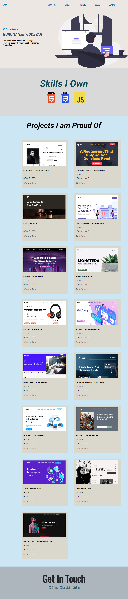

# Portfolio Page using HTML and CSS

Built With
- Html
- Css

*I developed this project using all the html and css concepts which i learnt in making 15 projects.*

[DEMO](https://gnw-portfolio.netlify.app/)

